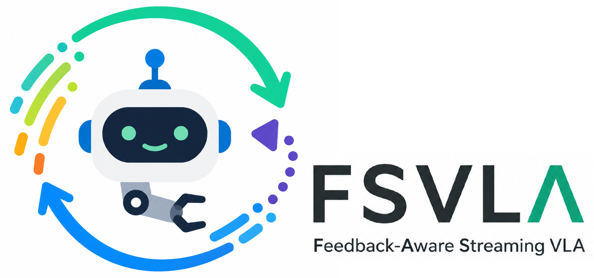
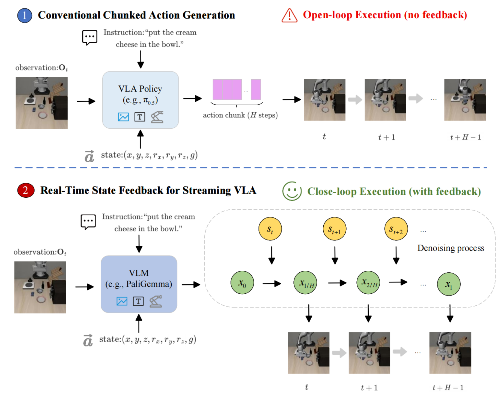
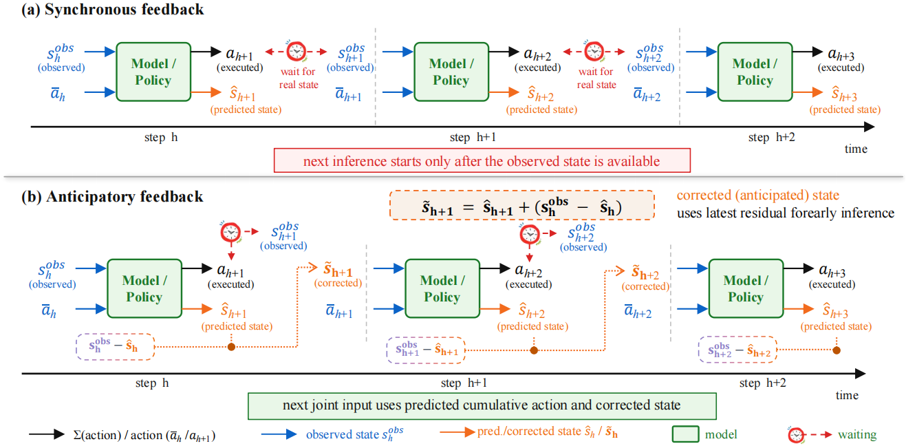

<p align="center">
  
</p>

<div align="center">


[](https://www.python.org/downloads/)
[](https://anonymous.4open.science/r/streamingVLA-2-9B86/LICENSE)
[](https://anonymous.4open.science/r/streamingVLA-2-9B86/)
[](https://github.com/huggingface/lerobot/tree/v0.3.2)

</div>

<div align="center">
  <p><strong>Making action chunks feedback-aware.</strong></p>
  <p>
    A streaming VLA framework that brings robot state feedback into action chunk generation.
  </p>

  <table>
    <tr>
      <td align="center">
        
      </td>
    </tr>
  </table>
</div>

<br/>

## Overview

Most Vision-Language-Action (VLA) models generate a chunk of future actions and execute it as a fixed sequence.
This improves temporal consistency, but it also means that the robot usually cannot adjust the generated chunk using newly observed execution states.
In other words, the action chunk can become partly open-loop during execution.

**Feedback-Aware Streaming VLA** addresses this issue by turning action chunk prediction into a streaming generation process.
Instead of treating the whole chunk as a fixed plan, the model generates the action stream while also modeling the robot state.
This allows state feedback to enter the action generation process and makes the action chunk less blind to execution changes.

The core idea is simple:

> The robot should not only predict what to do next, but also keep track of how its own state evolves during the action chunk.

## What This Repository Provides

This repository provides an implementation of Feedback-Aware Streaming VLA based on the SmolVLA / LeRobot v0.3.2 codebase.

The main components include:

- a StreamingVLA-style action head adapted to SmolVLA;
- joint state-action trajectory modeling;
- anticipatory inference for hiding part of the state-synchronization latency;

## Why Feedback-Aware Action Chunks?

Standard action chunking is efficient, but it can be too rigid.
Once a chunk is generated, the robot may execute several actions before the policy has a chance to react to the latest state.

Our method introduces robot state into the action generation process.
The model predicts both the future action evolution and the corresponding robot state evolution.
During execution, the action part is used to control the robot, while the predicted state part provides a useful interface for feedback correction.

This makes the model more suitable for streaming execution, where the policy can update its action stream using newly available state information.

## Anticipatory Inference

A direct feedback-based policy may need to wait for the latest robot state before predicting the next action.
This can introduce a visible gap between consecutive actions.

We reduce this issue with anticipatory inference.
The model uses its predicted state together with the latest available state residual to construct the next input early.
As a result, the next inference step can start before the newest observed state fully arrives.

<div align="center">
  <p><strong>Anticipatory inference hides state-synchronization latency.</strong></p>
  
</div>

This design does not require changing the full VLA backbone.
Most modifications are concentrated in the action head, training target, and state-action data construction.
Therefore, the deployment pipeline remains close to SmolVLA / StreamingVLA-style systems.

## Installation

This project is based on **LeRobot v0.3.2**.

Please first install LeRobot following the official instructions:

https://github.com/huggingface/lerobot/tree/v0.3.2#installation

A typical setup is:

```bash
git clone https://github.com/huggingface/lerobot.git
cd lerobot
git checkout v0.3.2
````

Then clone this repository:

```bash
git clone https://anonymous.4open.science/r/streamingVLA-2-9B86/
cd streamingVLA-2-9B86
```

Set the project path:

```bash
export PYTHONPATH=/your/project/streamingVLA-2-9B86/src:$PYTHONPATH
```

## Pretrained Models

We provide a pretrained 0.45B model evaluated on LIBERO:

* [Feedback-Aware-Streaming-VLA](https://huggingface.co/lidc/Feedback-Aware-Streaming-VLA)

For SmolVLA-based evaluation, we recommend rendering LIBERO observations at **512 × 512** resolution.

## Evaluate a Pretrained Policy

Example evaluation on LIBERO-Goal:

```bash
export CUDA_VISIBLE_DEVICES=0
export HF_HUB_OFFLINE=1
export PYTHONPATH=/your/project/streamingVLA-2-9B86/src:$PYTHONPATH

python lerobot/scripts/eval_LIBERO.py \
    --policy_path=outputs/train/your_model/pretrained_model/ \
    --task_suite_name=libero_goal
```

To evaluate other LIBERO suites, replace `--task_suite_name` with one of:

```bash
libero_spatial
libero_object
libero_goal
libero_10
```


## Method Summary

Feedback-Aware Streaming VLA extends StreamingVLA by modeling a joint state-action trajectory instead of only an accumulated action trajectory.
The model predicts both action and state evolution inside an action chunk, executes only the action output, and uses the predicted or observed state for feedback correction.

The backbone, observation format, action interface, and deployment pipeline remain largely the same as SmolVLA / StreamingVLA.
The main changes are in the action-head target, loss design, and state-action trajectory construction, so the results are directly comparable under the same LIBERO evaluation protocol.

In practice:

1. Accumulate delta actions.
2. Concatenate cumulative actions with robot states.
3. Train the action head to predict action and state evolution.
4. Execute actions and use state feedback for the next streaming step.

## Real-Robot Transfer Note

This repository focuses on the algorithmic part of feedback-aware streaming action generation.
Our implementation is built on the SmolVLA / StreamingVLA-style pipeline and keeps the main deployment interface unchanged.
Specifically, we do not modify the visual-language backbone, robot observation format, action execution format, or the overall evaluation pipeline.
The main changes are concentrated in the action-head target construction, the flow-matching loss, the state-action trajectory representation, and the optional anticipatory feedback logic.

Because of this design, our simulation results are directly comparable to SmolVLA / StreamingVLA-style baselines under the same LIBERO protocol.
The method is expected to inherit the real-robot deployment path of the underlying VLA system, as long as the same observation and action interfaces are available.
Nevertheless, real-robot performance can still be affected by hardware-specific factors such as controller frequency, state-estimation delay, camera latency, calibration, and low-level execution stability.
We therefore view real-world deployment as an important future evaluation rather than a separate engineering contribution of this release.


## Acknowledgements

This project builds on the open-source ecosystem of LeRobot, SmolVLA, LIBERO, SFP, and StreamingVLA.
We thank the authors and contributors of these projects for making their code and benchmarks available.

